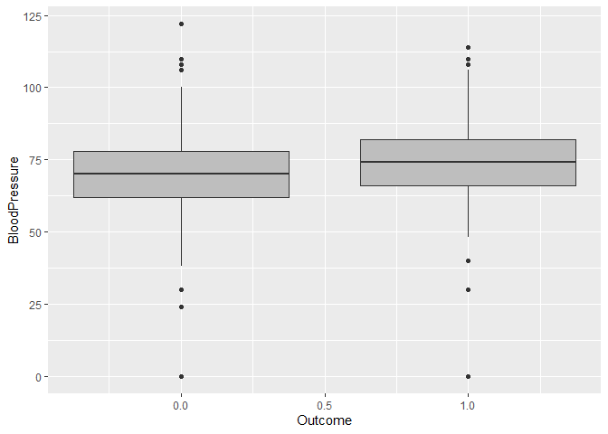

Diabetes Prediction
================
Aremu oluwasegun
2024-01-08

------------------------------------------------------------------------

# PREDICTING DIABETES

``` r
library(dplyr)
```

    ## Warning: package 'dplyr' was built under R version 4.2.3

    ## 
    ## Attaching package: 'dplyr'

    ## The following objects are masked from 'package:stats':
    ## 
    ##     filter, lag

    ## The following objects are masked from 'package:base':
    ## 
    ##     intersect, setdiff, setequal, union

``` r
library(ggplot2)
```

    ## Warning: package 'ggplot2' was built under R version 4.2.1

## Importing dataset

``` r
library(readr)
```

    ## Warning: package 'readr' was built under R version 4.2.1

``` r
diabetes_old <- read_csv("datasets/diabetes.csv")
```

    ## Rows: 768 Columns: 9
    ## ── Column specification ────────────────────────────────────────────────────────
    ## Delimiter: ","
    ## dbl (9): Pregnancies, Glucose, BloodPressure, SkinThickness, Insulin, BMI, D...
    ## 
    ## ℹ Use `spec()` to retrieve the full column specification for this data.
    ## ℹ Specify the column types or set `show_col_types = FALSE` to quiet this message.

``` r
View(diabetes_old)
```

### Checking the summary statistic

``` r
summary(diabetes_old)
```

    ##   Pregnancies        Glucose      BloodPressure    SkinThickness  
    ##  Min.   : 0.000   Min.   :  0.0   Min.   :  0.00   Min.   : 0.00  
    ##  1st Qu.: 1.000   1st Qu.: 99.0   1st Qu.: 62.00   1st Qu.: 0.00  
    ##  Median : 3.000   Median :117.0   Median : 72.00   Median :23.00  
    ##  Mean   : 3.845   Mean   :120.9   Mean   : 69.11   Mean   :20.54  
    ##  3rd Qu.: 6.000   3rd Qu.:140.2   3rd Qu.: 80.00   3rd Qu.:32.00  
    ##  Max.   :17.000   Max.   :199.0   Max.   :122.00   Max.   :99.00  
    ##     Insulin           BMI        DiabetesPedigreeFunction      Age       
    ##  Min.   :  0.0   Min.   : 0.00   Min.   :0.0780           Min.   :21.00  
    ##  1st Qu.:  0.0   1st Qu.:27.30   1st Qu.:0.2437           1st Qu.:24.00  
    ##  Median : 30.5   Median :32.00   Median :0.3725           Median :29.00  
    ##  Mean   : 79.8   Mean   :31.99   Mean   :0.4719           Mean   :33.24  
    ##  3rd Qu.:127.2   3rd Qu.:36.60   3rd Qu.:0.6262           3rd Qu.:41.00  
    ##  Max.   :846.0   Max.   :67.10   Max.   :2.4200           Max.   :81.00  
    ##     Outcome     
    ##  Min.   :0.000  
    ##  1st Qu.:0.000  
    ##  Median :0.000  
    ##  Mean   :0.349  
    ##  3rd Qu.:1.000  
    ##  Max.   :1.000

## Distribution of each independent variable

``` r
ggplot(diabetes_old, aes(Pregnancies,colour= "yellow")) +   geom_histogram(binwidth = 1) + xlab("Pregancy") + ylab("Frequency")
```

<!-- -->

``` r
ggplot(diabetes_old, aes(Glucose,colour= "yellow")) + geom_histogram(binwidth = 30) + xlab("Glucose") + ylab("Frequency")
```

<!-- -->

``` r
ggplot(diabetes_old, aes(BloodPressure,colour= "yellow")) + geom_histogram(binwidth = 10) + xlab("Blood Pressure") + ylab("Frequency")
```

<!-- -->

``` r
ggplot(diabetes_old, aes(SkinThickness,colour= "yellow")) + geom_histogram(binwidth = 7) + xlab("Skin Thickness") + ylab("Frequency")
```

<!-- -->

``` r
ggplot(diabetes_old, aes(Insulin,colour= "yellow")) + geom_histogram(binwidth = 20) + xlab("Insulin") + ylab("Frequency")
```

<!-- -->

``` r
ggplot(diabetes_old, aes(BMI,colour= "yellow")) + geom_histogram(binwidth = 1) + xlab("BMI") + ylab("Frequency")
```

<!-- -->

``` r
ggplot(diabetes_old, aes(DiabetesPedigreeFunction,colour= "yellow")) + geom_histogram(binwidth = 0.1) + xlab("DPF") + ylab("Frequency")
```

<!-- -->

``` r
ggplot(diabetes_old, aes(Age,colour= "yellow")) + geom_histogram(binwidth = 1) + xlab("Age") + ylab("Frequency")
```

<!-- -->

## Creating Age groups

``` r
diabetes <- diabetes_old %>%
  mutate(age_group = as.factor(ifelse(Age <=30, "20-30",ifelse(Age <=40, "31-40", ifelse(Age<=50, "41-50", "50+")))))
head(diabetes)
```

    ## # A tibble: 6 × 10
    ##   Pregnancies Glucose BloodPressure SkinThickness Insulin   BMI
    ##         <dbl>   <dbl>         <dbl>         <dbl>   <dbl> <dbl>
    ## 1           6     148            72            35       0  33.6
    ## 2           1      85            66            29       0  26.6
    ## 3           8     183            64             0       0  23.3
    ## 4           1      89            66            23      94  28.1
    ## 5           0     137            40            35     168  43.1
    ## 6           5     116            74             0       0  25.6
    ## # ℹ 4 more variables: DiabetesPedigreeFunction <dbl>, Age <dbl>, Outcome <dbl>,
    ## #   age_group <fct>

## Creating bins for Pregnancies

``` r
diabetes <- diabetes %>%
  mutate(preg_bin = as.factor(ifelse(Pregnancies <= 5, "0-5",ifelse(Pregnancies <=10, "6-10", "10+"))))
head(diabetes)
```

    ## # A tibble: 6 × 11
    ##   Pregnancies Glucose BloodPressure SkinThickness Insulin   BMI
    ##         <dbl>   <dbl>         <dbl>         <dbl>   <dbl> <dbl>
    ## 1           6     148            72            35       0  33.6
    ## 2           1      85            66            29       0  26.6
    ## 3           8     183            64             0       0  23.3
    ## 4           1      89            66            23      94  28.1
    ## 5           0     137            40            35     168  43.1
    ## 6           5     116            74             0       0  25.6
    ## # ℹ 5 more variables: DiabetesPedigreeFunction <dbl>, Age <dbl>, Outcome <dbl>,
    ## #   age_group <fct>, preg_bin <fct>

## Checking the relationship of other Indepedent variables on the Outcome

``` r
ggplot(diabetes, aes(x = Outcome, y = Glucose, group = Outcome)) +
  geom_boxplot(fill = "gray")
```

<!-- -->

``` r
ggplot(diabetes, aes(x = Outcome, y = BloodPressure, group = Outcome)) +
  geom_boxplot(fill = "gray")
```

<!-- -->

We can see that median glucose level and blood pressure is higher for
patients with diabetes. This is the same for all other independent
variables.

## Creating pivot tables for the age Groups and Pregnancies bins

``` r
xtabs(~Outcome + age_group, data = diabetes)
```

    ##        age_group
    ## Outcome 20-30 31-40 41-50 50+
    ##       0   327    81    49  43
    ##       1    90    76    64  38

``` r
xtabs(~Outcome + preg_bin, data = diabetes)
```

    ##        preg_bin
    ## Outcome 0-5 10+ 6-10
    ##       0 392  14   94
    ##       1 157  20   91

## Removing columns that will not be used from the Dataframe

``` r
diabetes <- diabetes%>%
select(-Age, - Pregnancies)
```

## Implementing Logistic Regression

``` r
logit <- glm(Outcome~., family = binomial,data = diabetes)
```

## Model Summary

``` r
summary(logit)
```

    ## 
    ## Call:
    ## glm(formula = Outcome ~ ., family = binomial, data = diabetes)
    ## 
    ## Deviance Residuals: 
    ##     Min       1Q   Median       3Q      Max  
    ## -2.7198  -0.7011  -0.4057   0.7069   2.8977  
    ## 
    ## Coefficients:
    ##                            Estimate Std. Error z value Pr(>|z|)    
    ## (Intercept)              -7.7833025  0.6966647 -11.172  < 2e-16 ***
    ## Glucose                   0.0353156  0.0037296   9.469  < 2e-16 ***
    ## BloodPressure            -0.0136602  0.0053479  -2.554 0.010640 *  
    ## SkinThickness             0.0003959  0.0070086   0.056 0.954955    
    ## Insulin                  -0.0010526  0.0009130  -1.153 0.248971    
    ## BMI                       0.0845869  0.0153475   5.511 3.56e-08 ***
    ## DiabetesPedigreeFunction  0.8353882  0.3035329   2.752 0.005919 ** 
    ## age_group31-40            0.9230287  0.2576645   3.582 0.000341 ***
    ## age_group41-50            1.2940517  0.3189180   4.058 4.96e-05 ***
    ## age_group50+              0.6987644  0.3371975   2.072 0.038240 *  
    ## preg_bin10+               0.4539952  0.4611920   0.984 0.324921    
    ## preg_bin6-10              0.3124185  0.2490406   1.254 0.209665    
    ## ---
    ## Signif. codes:  0 '***' 0.001 '**' 0.01 '*' 0.05 '.' 0.1 ' ' 1
    ## 
    ## (Dispersion parameter for binomial family taken to be 1)
    ## 
    ##     Null deviance: 993.48  on 767  degrees of freedom
    ## Residual deviance: 711.54  on 756  degrees of freedom
    ## AIC: 735.54
    ## 
    ## Number of Fisher Scoring iterations: 5

## Interpretation of Results

### For continuous variables:

#### Glucose

For every unit increase in glucose, the log odds of being diabetic
versus not being diabetic *increases* by **0.035**

#### Blood Pressure

For one unit increase in Blood pressure, the log odds of being diabetic
versus not being diabetic *decreases* by **0.014**.

### For Categorical Variables

The base category for the Age group is 20-30 and for pregnancies bin is
0-5.

#### Age Group

Being in the age 31-40, versus age group of 21-30, changes the log odds
of being diabetic by **0.92**.

#### Pregnancies Bin

Being in the pregnancy bin of 6-10,versus pregnancy bin of 0-5, changes
the odds of being diabetic by **0.31**.

## Refining the summary statistic

We use the stepAIC function to perform a step-wise selection of
variables.

``` r
library(MASS)
```

    ## Warning: package 'MASS' was built under R version 4.2.1

    ## 
    ## Attaching package: 'MASS'

    ## The following object is masked from 'package:dplyr':
    ## 
    ##     select

``` r
logit_1 <- stepAIC(logit)
```

    ## Start:  AIC=735.54
    ## Outcome ~ Glucose + BloodPressure + SkinThickness + Insulin + 
    ##     BMI + DiabetesPedigreeFunction + age_group + preg_bin
    ## 
    ##                            Df Deviance    AIC
    ## - preg_bin                  2   713.50 733.50
    ## - SkinThickness             1   711.54 733.54
    ## - Insulin                   1   712.86 734.86
    ## <none>                          711.54 735.54
    ## - BloodPressure             1   718.18 740.18
    ## - DiabetesPedigreeFunction  1   719.33 741.33
    ## - age_group                 3   732.15 750.15
    ## - BMI                       1   745.50 767.50
    ## - Glucose                   1   826.68 848.68
    ## 
    ## Step:  AIC=733.5
    ## Outcome ~ Glucose + BloodPressure + SkinThickness + Insulin + 
    ##     BMI + DiabetesPedigreeFunction + age_group
    ## 
    ##                            Df Deviance    AIC
    ## - SkinThickness             1   713.53 731.53
    ## - Insulin                   1   714.87 732.87
    ## <none>                          713.50 733.50
    ## - BloodPressure             1   720.36 738.36
    ## - DiabetesPedigreeFunction  1   721.08 739.08
    ## - BMI                       1   747.02 765.02
    ## - age_group                 3   755.16 769.16
    ## - Glucose                   1   829.21 847.21
    ## 
    ## Step:  AIC=731.53
    ## Outcome ~ Glucose + BloodPressure + Insulin + BMI + DiabetesPedigreeFunction + 
    ##     age_group
    ## 
    ##                            Df Deviance    AIC
    ## - Insulin                   1   715.03 731.03
    ## <none>                          713.53 731.53
    ## - BloodPressure             1   720.44 736.44
    ## - DiabetesPedigreeFunction  1   721.27 737.27
    ## - BMI                       1   751.12 767.12
    ## - age_group                 3   755.27 767.27
    ## - Glucose                   1   831.30 847.30
    ## 
    ## Step:  AIC=731.03
    ## Outcome ~ Glucose + BloodPressure + BMI + DiabetesPedigreeFunction + 
    ##     age_group
    ## 
    ##                            Df Deviance    AIC
    ## <none>                          715.03 731.03
    ## - DiabetesPedigreeFunction  1   722.00 736.00
    ## - BloodPressure             1   722.21 736.21
    ## - BMI                       1   751.34 765.34
    ## - age_group                 3   760.56 770.56
    ## - Glucose                   1   836.64 850.64

``` r
summary(logit_1)
```

    ## 
    ## Call:
    ## glm(formula = Outcome ~ Glucose + BloodPressure + BMI + DiabetesPedigreeFunction + 
    ##     age_group, family = binomial, data = diabetes)
    ## 
    ## Deviance Residuals: 
    ##     Min       1Q   Median       3Q      Max  
    ## -2.8510  -0.7028  -0.4026   0.7333   2.8172  
    ## 
    ## Coefficients:
    ##                           Estimate Std. Error z value Pr(>|z|)    
    ## (Intercept)              -7.544530   0.671205 -11.240  < 2e-16 ***
    ## Glucose                   0.033838   0.003469   9.756  < 2e-16 ***
    ## BloodPressure            -0.014000   0.005266  -2.659  0.00785 ** 
    ## BMI                       0.081839   0.014428   5.672 1.41e-08 ***
    ## DiabetesPedigreeFunction  0.777417   0.298118   2.608  0.00911 ** 
    ## age_group31-40            1.091046   0.235719   4.629 3.68e-06 ***
    ## age_group41-50            1.570648   0.266178   5.901 3.62e-09 ***
    ## age_group50+              0.904497   0.310213   2.916  0.00355 ** 
    ## ---
    ## Signif. codes:  0 '***' 0.001 '**' 0.01 '*' 0.05 '.' 0.1 ' ' 1
    ## 
    ## (Dispersion parameter for binomial family taken to be 1)
    ## 
    ##     Null deviance: 993.48  on 767  degrees of freedom
    ## Residual deviance: 715.03  on 760  degrees of freedom
    ## AIC: 731.03
    ## 
    ## Number of Fisher Scoring iterations: 5

Now, we are left with 5 significant independent variables- **Glucose**,
**Blood Pressure**, **BMI**, **Diabetes Pedigree Function** and
**Age_group** all which increase the chance of being Diabetic.

## Analysis of the Outcome

We use the summary function to analyse the predicted probability

``` r
summary(logit_1$fitted.values)
```

    ##     Min.  1st Qu.   Median     Mean  3rd Qu.     Max. 
    ## 0.002269 0.111327 0.259469 0.348958 0.540302 0.985182

The women from the data have about **35%** probability on average to be
diabetic.

We create histogram to analyze the distribution of predicted probability

``` r
ggplot(logit_1, aes(logit_1$fitted.values, colour = "red")) +
  geom_histogram(binwidth = 0.05, fill = "blue") +
  xlab("Prob of being diabetic")+
ylab("Frequency")
```

<!-- -->

The resulting plot is left-skewed, we can deduce that the majority of
women from the database have *less probability* to be diabetic.
